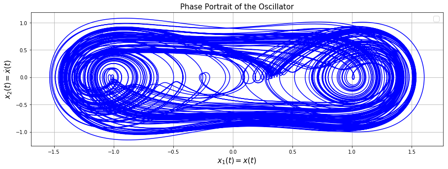

# Duffing Oscillator

Python code and thorough documentation on solving the Duffing oscillator; this project was completed in 2017 as part of Computational Physics 2 course at the University of Waterloo.
- - - -
The Duffing oscillator is a second order, nonlinear, chaotic oscillator. It will be solved, and include a brief discussion into the numerical method chosen.  The chaotic behaviour of this oscillator will also be discussed by showing plots and discussing stability and convergence of the solution.

The Duffing oscillator, named after Georg Duffing (1861–1944), is represented by a second order differential equation. This equation has no exact analytic solution and therefore must be approximated using either perturbation theory or solved numerically. The Duffing oscillator is different from other oscillators due to it's restoring force, which is not proportional to it's extension distance (this refers to the x^3 term).

Through nonlinear analysis, it was determined that a trapezoidal method would be stable (and thus, suitable) for this equation. However, to ensure convergence we would have to take a step size of at least h^3. Only once it was determined we could find a stable, convergent method that is second order in time, we then implement numerical scheme for the Duffing oscillator. A Newton-Raphson method was also used to linearize the equation.

